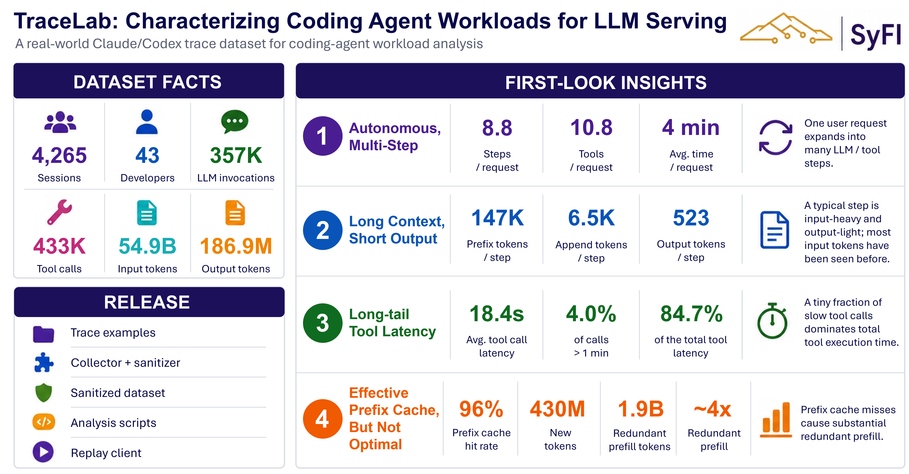

<div align="center">

<h1>TraceLab</h1>

**A real-world Claude / Codex trace & open toolkit for coding-agent workload analysis.**

Collect · sanitize · analyze · visualize the LLM-invocation traces that coding agents
actually produce in the wild — then explore them in your browser.

[**🌐 Live demo**](https://tracelab.cs.washington.edu) ·
[**Quickstart**](#-quickstart) ·
[**Dataset**](#-the-dataset) ·
[**Experiments**](#-analysis-experiments) ·
[**Web app**](#-web-app) ·
[**Data format**](#-data-format)

[](LICENSE)
[](LICENSE-DATASET.md)
[](https://tracelab.cs.washington.edu/paper.pdf)
[](#)
[](#-the-dataset)

</div>

---

## What is TraceLab?

Coding agents like **Claude Code** and **Codex** quietly emit a rich event log every time
they run: each LLM invocation, every tool call, the prompt-cache splits, and the timing in
between. TraceLab turns those scattered local session files into a clean, **sanitized,
analyzable dataset** — and ships the tooling to reproduce every figure, plus a web app to
explore traces (yours or ours) without writing any code.

- 📦 **A public dataset** — 357K LLM rounds from 43 developers' real Claude/Codex sessions, pseudonymized and free to download.
- 🔬 **A reproducible pipeline** — `collect → sanitize → analyze → validate`, each stage a single command.
- 📊 **Self-contained experiments** — every figure documents the exact question it answers and embeds its own data + code.
- 🌐 **A zero-install web app** — drag in a trace, get interactive analytics in-browser, and ask an AI about it. [Try it »](https://tracelab.cs.washington.edu)

<div align="center">



</div>

---

## 🚀 Quickstart

Install dependencies with [uv](https://github.com/astral-sh/uv):

```bash
uv sync
```

### Track A — explore the public dataset

Download the pinned release assets, then run any experiment against them:

```bash
mkdir -p trace
curl -L --fail -o trace/syfi_coding_trace.duckdb \
  https://github.com/uw-syfi/TraceLab/releases/latest/download/syfi_coding_trace.duckdb

# Headline aggregate facts (add --json for machine-readable output)
uv run python artifacts/trace_facts/overview_summary/analyze.py \
  --db trace/syfi_coding_trace.duckdb

# Regenerate all analysis artifacts from the released DuckDB
uv run python artifacts/run_all.py
```

See [The dataset](#-the-dataset) for the full download + checksum recipe.

### Track B — analyze your own traces

Turn your local Claude/Codex history into a shareable, sanitized trace and regenerate
every figure:

```bash
# 1. Collect a fresh private normalized trace
uv run python scripts/collect_llm_traces.py \
  --extract-rounds trace/llm_round_trace.jsonl --fresh-extract

# 2. Sanitize it (pseudonymize ids, strip local paths & tool inputs)
uv run python scripts/sanitize_round_trace.py \
  trace/llm_round_trace.jsonl -o trace/llm_round_trace.public.jsonl

# 3. Regenerate all analysis artifacts
uv run python artifacts/run_all.py \
  --build-db --input trace/llm_round_trace.public.jsonl \
  --db trace/llm_round_trace.public.duckdb

# 4. Run validation / audit checks
uv run python validators/run_all.py --input trace/llm_round_trace.public.jsonl
```

> Prefer a UI? Drag a trace export into the [web app](#-web-app) and get the same
> analytics in your browser — nothing leaves your machine.

---

## 📦 The dataset

The sanitized all-user trace and a prebuilt DuckDB database are distributed as
**GitHub Release assets** (not committed to Git history).

<table>
<tr><td>

| | |
|---|---|
| **Rows (LLM rounds)** | `357,161` |
| **Tool records** | `432,510` |
| **Pseudonymous users** | `43` |
| **Providers** | `claude=140,338` · `codex=216,823` |
| **Release tag** | `v0.0.1` |

</td><td>

**Assets**
- `syfi_coding_trace.jsonl.gz` — normalized JSONL trace
- `syfi_coding_trace.duckdb` — prebuilt DuckDB database

**SHA256**
- JSONL · `9d265eae…da0b4e6b`
- DuckDB · `97715265…d9f15619`

</td></tr>
</table>

<details>
<summary><b>Download &amp; verify the pinned release</b></summary>

```bash
mkdir -p trace
curl -L --fail \
  -o trace/syfi_coding_trace.jsonl.gz \
  https://github.com/uw-syfi/TraceLab/releases/download/v0.0.1/syfi_coding_trace.jsonl.gz
curl -L --fail \
  -o trace/syfi_coding_trace.duckdb \
  https://github.com/uw-syfi/TraceLab/releases/download/v0.0.1/syfi_coding_trace.duckdb

echo "9d265eae69a31cae203848bea936f018148eed7ca8bf56050c5abe96da0b4e6b  trace/syfi_coding_trace.jsonl.gz" | sha256sum -c -
echo "97715265367cc72376475f5d444c8e1900b88cab1482aa7b9a742894d9f15619  trace/syfi_coding_trace.duckdb"   | sha256sum -c -
gzip -t trace/syfi_coding_trace.jsonl.gz
```

Always fetch the newest published assets with the `latest` redirect:

```bash
curl -L --fail -o trace/syfi_coding_trace.jsonl.gz \
  https://github.com/uw-syfi/TraceLab/releases/latest/download/syfi_coding_trace.jsonl.gz
curl -L --fail -o trace/syfi_coding_trace.duckdb \
  https://github.com/uw-syfi/TraceLab/releases/latest/download/syfi_coding_trace.duckdb
```

Decompress when a JSONL input is needed:

```bash
gzip -dk trace/syfi_coding_trace.jsonl.gz
uv run python artifacts/trace_facts/overview_summary/analyze.py -i trace/syfi_coding_trace.jsonl
```

</details>

> 🔒 The dataset is licensed under **[CC BY 4.0](LICENSE-DATASET.md)** and is fully
> sanitized — ids are pseudonymized and local context (paths, `cwd`, tool inputs) is
> stripped before release. Please use it responsibly and don't attempt re-identification.

---

## 🗂️ Repository layout

```
TraceLab/
├── scripts/      # data pipeline — collection, extraction, sanitizing
├── artifacts/    # analysis & plotting experiments, by category, + shared utils/
├── validators/   # integrity / denominator / formula audits (kept out of the plot tree)
├── trace/        # generated normalized JSONL traces (gitignored outputs)
├── docs/         # cross-cutting methodology notes shared by experiments
├── web/          # the TraceLab web app (Astro UI + AI / contribute / local sidecars)
└── example_sessions/  # small public expanded trace examples with human explanations
```

Each **experiment** lives in `artifacts/<category>/<experiment>/` with one analyze/plot
script, a `README.md` documenting its question and metric definitions, and (when run) its
generated outputs. Only scripts and `README.md` files are tracked — generated
`*.png/*.csv/*.json` outputs are gitignored.

- **Artifact categories:** `trace_facts`, `llm_generation`, `tool_calls`, `prefix_cache`,
  `human_in_the_loop`, `session`, plus shared `utils`.
- **Validator categories:** `human_in_the_loop`, `trace_facts`.

---

## 🔬 Pipeline

The end-to-end flow is four single-command stages: **collect → sanitize → analyze →
validate** (see [Quickstart Track B](#track-b--analyze-your-own-traces) for the full run).

`artifacts/run_all.py` also derives the timing-fit CSV locally before timing analyses run,
so a normal full run needs no separate timing-preprocessing step.

<details>
<summary><b>Collection options</b></summary>

```bash
# Extract a normalized combined Claude/Codex round trace from the launching user's home
uv run python scripts/collect_llm_traces.py --extract-rounds

# Scan every user home under /home instead
uv run python scripts/collect_llm_traces.py --all-user --extract-rounds

# Sudo-backed all-user collection that keeps outputs owned by the launching user
scripts/collect_all_users_sudo.sh --sanitize
```
</details>

<details>
<summary><b>What sanitization does</b></summary>

`sanitize_round_trace.py` rewrites session, round, turn, tool-call, project, and user
identifiers with stable pseudorandom replacements. It removes local context fields such as
`home`, `cwd`, `workdir`, `session_file`, and path-like keys, and drops `tools[].input`
entirely while preserving `input_chars`. Distinct-user counts remain available through
pseudonymous `user` values.
</details>

<details>
<summary><b>Pipeline scripts</b></summary>

- `collect_llm_traces.py` — scan Claude/Codex local history, count sessions, optionally write normalized round traces.
- `collect_all_users_sudo.sh` — sudo-friendly wrapper for all-user extraction.
- `extract_claude_rounds.py` / `extract_codex_rounds.py` — convert provider JSONL sessions into normalized round rows.
- `sanitize_round_trace.py` — remove public-release-sensitive fields.
- `find_representative_session_segments.py` — find compact raw-session windows for examples.
</details>

---

## 📊 Analysis experiments

Every analysis is a self-contained experiment under `artifacts/<category>/<experiment>/`.
Read that folder's `README.md` for the question it answers and exactly how it computes its
metric; shared metric definitions live in
[`artifacts/utils/README.md`](artifacts/utils/README.md). Most experiments accept the
released DuckDB at `trace/syfi_coding_trace.duckdb`; JSONL inputs are still supported for
scripts that expose `-i` / `--input`. Outputs are written into each experiment folder:

```bash
# Headline aggregate facts (text or --json)
uv run python artifacts/trace_facts/overview_summary/analyze.py \
  --db trace/syfi_coding_trace.duckdb
# Input-token composition; tool latency; generation-time CDFs
uv run python artifacts/llm_generation/prefix_append_distribution/plot.py \
  --db trace/syfi_coding_trace.duckdb
uv run python artifacts/tool_calls/tool_latency_distribution/plot.py \
  --db trace/syfi_coding_trace.duckdb
uv run python artifacts/llm_generation/generation_time_cdf/plot.py \
  --db trace/syfi_coding_trace.duckdb
# Multi-round CSV export
uv run python artifacts/trace_facts/csv_export/convert.py \
  --db trace/syfi_coding_trace.duckdb \
  -o artifacts/trace_facts/csv_export/coding_trace.csv
```

Each figure driver owns its plotting/CSV payload and imports shared primitives from the
`artifacts/utils/` modules (`trace_loader`, `style`, `accumulators`, `formatters`,
`tool_stats`, `cdf`). Common loader options: `--group-by`, `--sample-size`,
`--per-tool-sample-size`, `--min-tool-calls-for-plot`, `--seed`.

<details>
<summary><b>Self-contained figures</b> — every PNG embeds its own README, data, and code</summary>

As the final step of each plotting experiment, every PNG embeds its README, the source CSV
data, and the plotting code as compressed PNG text chunks (CSVs are still written
normally). Inspect or unpack any figure with the helper:

```bash
python artifacts/utils/png_sidecar.py list    <figure>.png
python artifacts/utils/png_sidecar.py extract <figure>.png -o ./unpacked
```
</details>

<details>
<summary><b>Timing-fit family</b> — local derived timing CSV</summary>

The timing-fit family owns its derived timing-segment CSV locally. `artifacts/run_all.py`
builds `artifacts/llm_generation/timing_fit/timing_fit_trace.csv` from the selected JSONL
trace before running timing analyses. Use `--timing-input` only when you intentionally want
to consume an existing external timing CSV instead of deriving one from `--input`. To build
the local timing CSV directly:

```bash
uv run python artifacts/llm_generation/timing_fit/collect_timing_fit_trace.py \
  -i trace/llm_round_trace.jsonl
```
</details>

### Validators

Validators are integrity checks and denominator/formula audits. They write Markdown/CSV
reports next to the validator, under `validators/`, and are intentionally kept out of the
plotting artifact tree.

```bash
uv run python validators/run_all.py
uv run python validators/run_all.py --list
uv run python validators/run_all.py --only human_in_the_loop
uv run python validators/run_all.py --only trace_facts/tool_duplicate_audit
uv run python validators/run_all.py --input trace/llm_round_trace.public.jsonl
```

---

## 🌐 Web app

Explore traces without writing any code at **[tracelab.cs.washington.edu](https://tracelab.cs.washington.edu)**:

- **Analyze** — drag in a Claude/Codex export and get interactive ECharts analytics, computed in-browser (Pyodide) — your data never leaves your machine.
- **Ask the trace** — chat with an AI about the public dataset or your own upload.
- **Contribute** — optionally donate a sanitized trace to grow the public dataset.

### Self-host

The whole stack runs locally. From the repo root:

```bash
./launch.sh                 # frontend + local sidecar; auto-analyzes your ~/.claude + ~/.codex
./launch.sh --master-server # full stack: AI backend + contribute backend + site
```

The dev workflow (ports, individual services, status checks) is documented in
[`web/README.md`](web/README.md). Ports and the LLM backend live in
[`config/services.json`](config/services.json).

---

## 📐 Data format

Each extracted JSONL row is one LLM invocation, keeping token-accounting fields, an ordered
timing list, and nested tool metadata.

<details>
<summary><b>Normalized row structure</b></summary>

- Top-level fields include provider/session ids, model, input/output token counts,
  cache-prefix split, source store, `timing_events`, and `trace_key`.
- `timing_events[]` is the ordered trace-observed event list for the round. It may include
  `user_message`, `tool_result`, `reasoning`, `text`, `tool_call`, and Codex
  `usage_report` entries.
- Private extracted traces include serialized tool `input`; sanitized public traces remove
  `tools[].input` and keep only `input_chars`.
- `tools[]` includes `tool_name`, `tool_call_id`, `emitted_at`, `input_chars`,
  `result_chars`, `tool_wall_latency_ms`, `tool_internal_latency_ms`, `is_error`, and
  `result_at`. Full tool outputs are not stored — content is summarized by `result_chars`.
</details>

<details>
<summary><b>Token accounting</b></summary>

```text
input_tokens_total = prefix_tokens + newly_append_tokens
```

`claude_cache_creation_input_tokens` is emitted after `newly_append_tokens`. For Claude
rows it is copied from `usage.cache_creation_input_tokens`; for Codex rows it is `null`.
`newly_append_tokens` still includes both Claude uncached `input_tokens` and Claude
cache-write tokens.

See [`docs/prompt_cache_accounting.md`](docs/prompt_cache_accounting.md) for the full
prompt-cache accounting derivation.
</details>

<details>
<summary><b>Latency fields</b></summary>

Tool latency is split into two fields:

- `tool_wall_latency_ms` — trace-observed wall latency, computed as `result_at - emitted_at`.
- `tool_internal_latency_ms` — tool/runner-reported duration when available (Codex wrapper
  `Wall time` or Claude `durationMs` / `durationSeconds`); otherwise `null`.

Analyses use `tool_internal_latency_ms` when present, then fall back to
`tool_wall_latency_ms`. The CSV exporter uses `tool_wall_latency_ms` for
`tool_wait_after_ms` by default.

For LLM-side latency, use `timing_events[]` rather than a first/last timestamp pair. The
usual proxy for "input ready → next tool input" is the latest `user_message` or
`tool_result` event before the first `tool_call`, subtracted from that `tool_call`
timestamp.
</details>

The single-source-of-truth metric definitions (effective tool latency, observable
generation time, human input wait, user-turn response time, prefix hit ratio, adjusted
append, KV active ratio, growth buckets) are collected in
[`artifacts/utils/README.md`](artifacts/utils/README.md).

---

## 🤝 Contributing

Contributions are welcome — whether it's a new analysis experiment, a validator, a fix, or
a donated sanitized trace. A good experiment is **self-contained**: one script, a
`README.md` stating the question and metric, and outputs that regenerate from the public
trace. By submitting a contribution you agree to license it under the project's
[Apache 2.0](LICENSE) (code) / [CC BY 4.0](LICENSE-DATASET.md) (data) terms.

## 📑 Citation

If you use TraceLab — the dataset, the toolkit, or the figures — please cite:

```bibtex
@misc{zhu2026tracelab,
  title        = {TraceLab: Characterizing Coding Agent Workloads for LLM Serving},
  author       = {Kan Zhu and Mathew Jacob and Chenxi Ma and Yi Pan and Stephanie Wang and Arvind Krishnamurthy and Baris Kasikci},
  year         = {2026},
  howpublished = {\url{https://tracelab.cs.washington.edu}},
  note         = {SyFI Lab, University of Washington}
}
```

## 📄 License

- **Code** — [Apache License 2.0](LICENSE)
- **Public trace dataset** — [Creative Commons Attribution 4.0 International (CC BY 4.0)](LICENSE-DATASET.md)

<div align="center">
<sub>Built by the <a href="https://syfi.cs.washington.edu">SyFI Lab</a> at the University of Washington.</sub>
</div>
